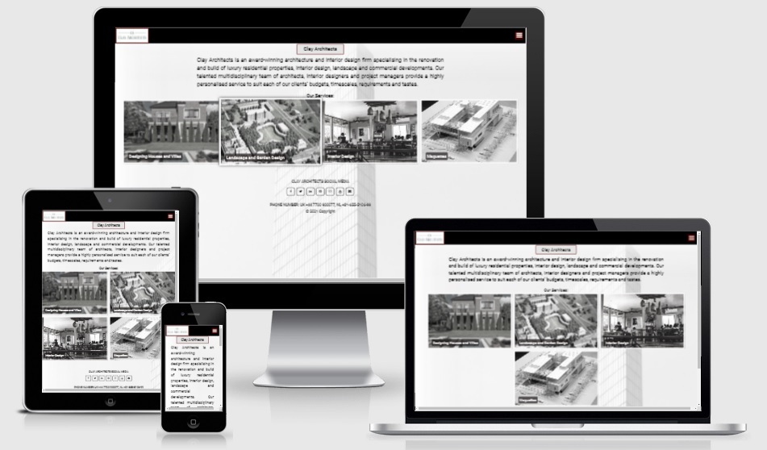
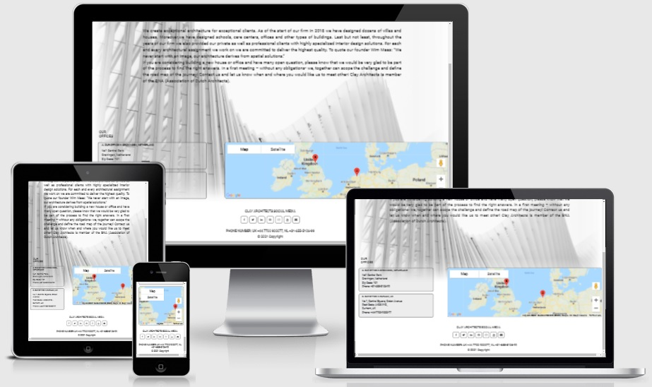
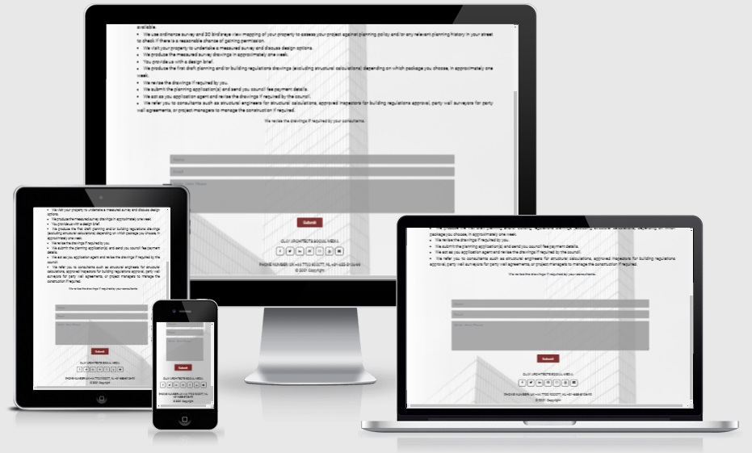
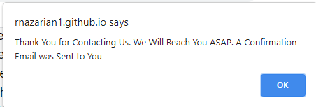
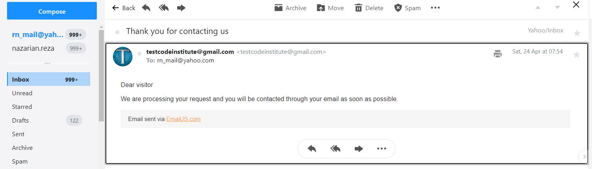
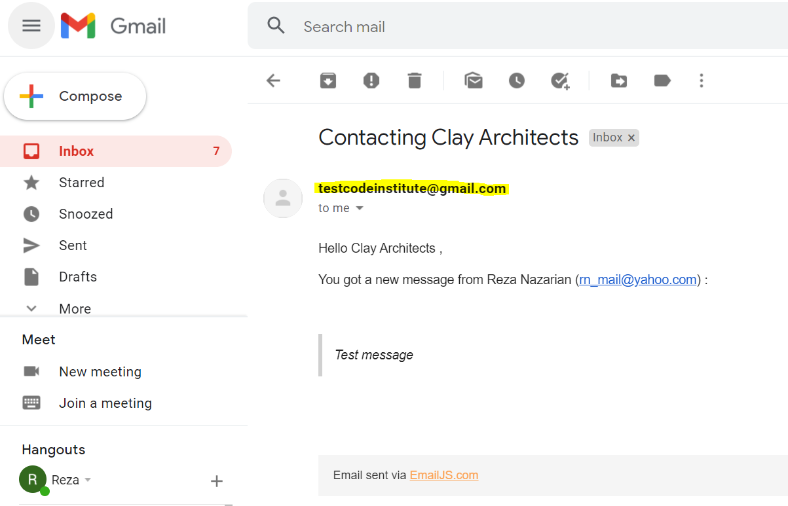
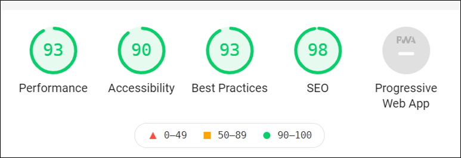

# Clay Architects
## A public hub for an architecture company 

[Web Access](https://rnazarian1.github.io/clay_architects/index.html)

**Clay Architects**  is written by Reza Nazarian for Code Institute Second Milestone project.

This website is made written by using **HTML**, **CSS**,  and **Javascript**.
***
## **Content**

* [Overview](#overview)
* [User Stories](#user-stories)
* [UX](#ux)
* [Features](#features)
* [Technologies used](#technologies-used)
* [Resources](#resources)
* [Testing](#testing)
* [Deployment](#deployment)
* [Acknowledgments](#acknowledgments)

## **Overview**

This website is develped based for a startup architecture company by focusing on simplicity and practicality of the website . 
the visitors are expected to be a wide range of people from normal people to architecture and civil engineering companies and manicipalities. The website tends to be simple elegant and at the same time its design is simple and practical. 
It shou8ld display the services at the first glance.

## **User Stories**

Website visitors include: 
* Those who are looking for unique and costomised designed houses or refurbishing existing dwellings
* Those clients who are looking for interior design for houses, offices or businesses such as stores and shops
* Many bigger companies that are outsourcing landscape designe as part of their projects or manicipalities who are planning to create parks and green spaces and also people who want their gardens in shape 
* Architects and Engineers who need a realistic 3D view and feasibility studies for their projects
This website is a a small hub for connecting all those people together and get serices 

* A **Manicipality** wants to check if a company has experties in landscape design and at the same time has experiences in designing dwellings or even making maquettes for feasibility and 3D display of the design as a requirement or publicity.
* Many **home owners** requre to design their gardens and backyards so they can find their services easily as a separate service item.
* As a **civil engineering company** need to plan landscape for their projects and they want to be sure the service provider can understand working with civil engineers by looking at company experties profile.
* **Normal citizens**  who dreams of having their own  future dream home or villa, need to know which steps they are going through from the beginning to the end of their project.
* **All users** are able send an email to the company. A popup message confirms if they were able to send their email and also a confrimation email will be  sent to their email automatically.
* **All users** can see the location of **Clay Architects** main offices with addresswes and phone numbers. So visitors know to visit the Clay Architects people and offices in person.
* **All users** are able to check the companies social media.

## **UX**

###  &nbsp; &nbsp; **a.Strategy**

The strategy is topromote Clay Architects through a minimalist website where only necessary information about a startup architecure company is provided to the visitors so it aooears to be more focused on services and real project rather than endless number of  marketting materials.

###  &nbsp; &nbsp; **b.Scope**

It is a simple minimalistic website with listed services immediately visible under the home page, a page for company introduction and office locations displayed on google map. There is a **Typical Work Stage**. There is an email form to get the visitors contact. The website will have social media links under each page.

### &nbsp; &nbsp; **c.Structure**

The website has three pages wnd a menu bar which links all pages together.

The website will be responsive. and its [wireframe](assets/wireframe/lms2_clay_architect_framework.pdf) shows the blueprint of the project. The pages are displayed on three devises (desktop, tablet and smart-phone)

### &nbsp; &nbsp; **d.Surface**

### &nbsp; &nbsp; &nbsp; **d.I.Color**

The color theme is a black and white theme with shadows of grey and a secondary color of rgb(99,1,1,) appears for some borders and by collor change effect by hovering on social media icons.
The floralwhite color is also used for some borders and hamburger menu.

### &nbsp; &nbsp; &nbsp; **d.II.Typography**

Google Font **Roboto** with a fallback of **sans sarif** is selected for the entire project. 

### &nbsp; &nbsp; &nbsp; **d.III.Images**

Images are prepared from public domain and converted to png format for better web performance.

## **Features**

**Navigation Bar**

Anavigation bar is created on the top with a hamburger menu in the right and a logo on the left in a responsive mode.
The menu appears on all three pages and links the pages to the rest of the pages of the website.

**Home Page**

 [The home page](index.html) contains the company name and an introduction to the company. Then four main services are listed in picturial blocks with an overlaying text referring to the related services.

**Who we are**

[Who we are page](whoweare.html) starts with a paragraph leveraging on the goals and objectives of the company and creates confidence. the offices then are listed in addresses and located on google map.

**Contact**

[The contact page](contact.html) the contact page lists the typical work stages that the clients goes through and an email form underneath. The email has few features as per the followings:

#### &nbsp; **A popup message** 
 A popup mesaage indicates if the visitor was able to sent a message successfuly.

#### &nbsp; **A confirmation email**

It will submit a confirmation email to the visitor who has sent an email. This email tell the visitor that soon will be contacted.

#### &nbsp; **An email to the Clay Architects**

The email will send an email to the Clay Architects dedicated email.

**Footer**

The footer incluudes links to social media company accounts and copyright sign. This footer repeats on all pages. The theme is  transparent icons in black or floralwhaite (depends on visibility) while changing the background color once hovered on by mouse.

## **Technologies Used**

## &nbsp; &nbsp; a. Languages

HTML, CSS and Javascript were used for the website.

## &nbsp; &nbsp; b. Associated technologies

Jquery, Font Awesome, Google Fonts and Microsoft PowerPoint (for creating framework) was used in developing the website.

## &nbsp; &nbsp; c. Workspace, version control, and Repository storage

* [Github](https://en.wikipedia.org/wiki/GitHub)  

   Github is used to make **Repositories** and for **Version Control**.
* [Gitpod](https://www.gitpod.io/)

   Gitpod is the main cloud-based editor for this project. Workspaces are made using the green Gitpod button in Github.

## &nbsp; &nbsp; d. Other tools

* [AutoPrefixer](https://autoprefixer.github.io/)

  AutoPrefixer is used to make the site compatible with all browsers.
* [W3C Validator](https://validator.w3.org/)

  W3C validator is used for testing HTML and CSS for the site.
* [JSHint](https://jshint.com/)  

  JSHint is used for testing javascript code for the site.
* [Am I Responsive](https://amiresponsive.co.uk/)

  Am I Responsive site is used to take a mockup screenshot of the project, which is attached at the beginning of this document.
* [Online Spelling Check](https://www.grammarly.com/)

   Grammarly is used to check spelling and grammatical errors.
 ***

## **Resources**

[Code Institute Course Content](https://courses.codeinstitute.net/program/FullstackWebDeveloper)- Main source of fundamental knowledge.

 * Code institute **Slack Community**- Main source of assistance.

 * [Stack Overflow](https://stackoverflow.com/)- General Resources.

 * [Youtube](https://www.youtube.com/)- General Resource.

 * [iColorpalette](https://icolorpalette.com/)- Find a relevant color palette for the site.

  * [Am I Responsive](http://ami.responsivedesign.is/)- Responsive website mockup image generator.
  
* [MDN Web Docs](https://developer.mozilla.org/en-US/)- General resources

* [Google Map Platform](https://developers.google.com/maps/documentation)- Setting Google map API

* [Email JS](https://www.emailjs.com/)- Setting Email

## **Testing**

[Responsiveness](http://ami.responsivedesign.is/)

* All pages are tested for responsiveness:

**Checking Email**

A separate google email account is made for the website for the test of the projects.

* 

* 

*  

[W3C Markup Validation Service](https://validator.w3.org/)

* There was an error regrding cash-control setting and due to that the cashe-control setting was removed from the heading. The cash-control need to be investigated for proper setup.

* There is also error in regard to the positioning a div under a Ul and an span under ul which in both cases I found them work pretty well so I decided to leave them. The warning are minor and are related to the hyphens under a commented line which is neglegeble.

[W3C CSS Validation Service](https://jigsaw.w3.org/css-validator/)

* has generated no errors or warnings

[JSHint](https://jshint.com/)

* both [sendemail.js](assets/js/sendemail.js) and [whoarewe.js](assets/js/whoarewe.js) have generated few warnings which could be ignored as the script works!

[Lighthouse testing ](https://www.webpagetest.org/lighthouse/)

The finished site was checked through Lighthouse Developer tool and the result found is attached here.

The best practices section showing `amber` because of low resolution of the images, which I kept purposefully to load the page faster.

## **Deployment**

This project is developed using the **Github** Repository. Coding is done in the workspace provided by **Gitpod**.

Steps were taken to deploy the project
1. Log into [Github](https://github.com/).
2. Select [RNazarian1/Clay_Architects](https://rnazarian1.github.io/clay_architects/).
3. Go to settings on the top right and scroll down to Github Pages.
4. Under source link dropdown change the none to **master** branch.
5. The page will be refreshed automatically and we will have a link to the live **URL**.

To run locally, You can clone this repository directly in the editor of your choice by

`git clone` and adding the URL of the site.

`git clone https://rnazarian1.github.io/clay_architects/`

and the local clone will be created.
***

## **Acknowledgments**

My mentor **Nishant Kumar** for being patient with me.
Code Institute Slack community for 24/7 availability and support.
Online code institute Tutor support for excellent support.
Special thanks to the student Kiran Kumari Satyarthy for her suggestions.
***

